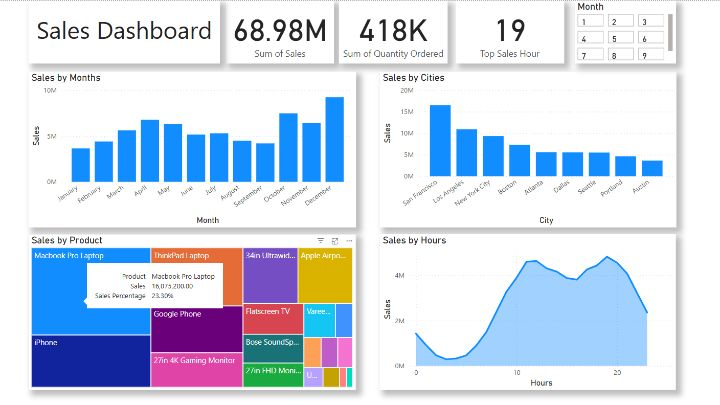

# 📊 Sales Analysis Dashboard 2019

## 📋 Project Overview
This project analyzes retail sales data over the year 2019 to uncover key trends, seasonal behaviors, and business opportunities through a dynamic dashboard.

## 🎯 Business Goals
To discover actionable insights from historical sales data, optimize business decision-making, and identify opportunities to maximize revenue and operational efficiency.

## ❓ Problem Statement
How can the business better understand its sales performance across time, locations, and products to drive targeted strategies and improve profitability?

## 📂 Dataset Description
- Source: Synthetic sales transaction data
- Records: ~340,000 rows
- Key columns: Order Date, Product, Sales, City, Purchase Hour

## 🛠️ Tools & Technologies
- Python (Pandas, Matplotlib)
- Power BI (Dashboard creation)

## 🧠 Key Insights
- December is the highest revenue month.
- San Francisco leads all cities in sales.
- MacBook Pro Laptop generates the highest revenue.
- Peak shopping hours occur between 18:00 and 20:00.

## 📸 Dashboard Preview

## 🚀 How to Use
- Open `2. notebook/sales_analysis.ipynb` to review the data cleaning and exploratory analysis process.
- Open `3. dashboard/Sales Analysis Dashboard.pbix` in Power BI to interact with the final dashboard.

## 🙏 Acknowledgment
- This dataset is synthetic and used solely for educational and portfolio purposes.
