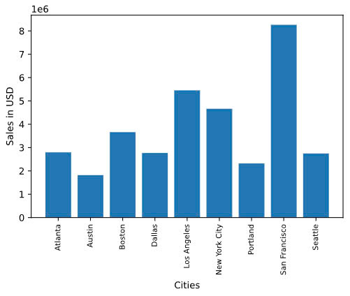
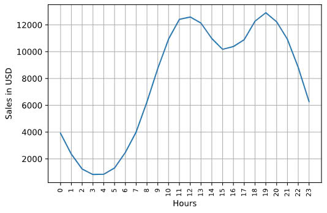
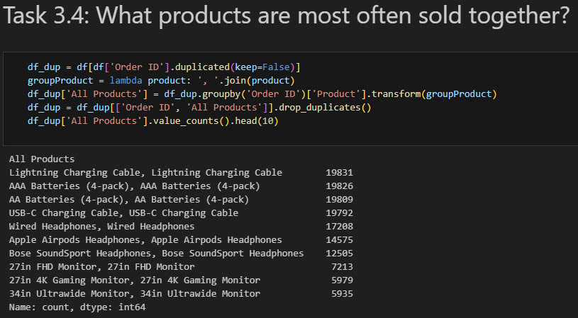
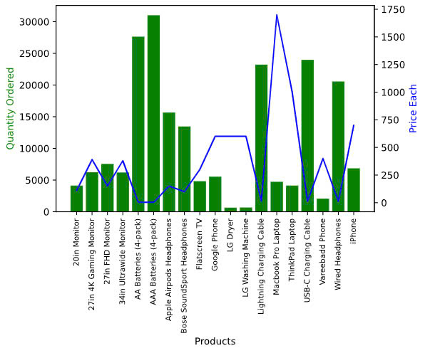

# Sales Analysis in an E-commerce Business 📊  

## Industry Focus  
This project focuses on the **E-commerce industry**, which has experienced exponential growth in recent years. By leveraging data-driven insights, businesses can optimize their sales strategies and improve customer satisfaction.  

## Problem Statement  
Understanding customer purchasing behaviors and identifying sales trends are crucial for maximizing revenue. However, businesses often struggle with:  
- Identifying the best-performing time periods and locations.  
- Understanding product pairing and demand patterns.  
- Targeting customers effectively to drive sales growth.  

## Business Use Case  
This analysis aims to help an e-commerce business:  
- Increase revenue by identifying high-performing time periods, cities, and products.  
- Optimize marketing strategies by determining the best time to display advertisements.  
- Enhance product offerings by analyzing frequently sold-together items.  

## Goals  
1. **Identify the best month for sales and total revenue earned during that month.**  
2. **Determine the city with the highest sales performance.**  
3. **Find the optimal time to display ads for maximum customer engagement.**  
4. **Analyze products that are most often sold together to inform bundling strategies.**  
5. **Identify the best-selling products and investigate why they perform well.**  

## Deliverables  
1. **Insights & Visualizations**:  
   - Monthly sales trends.  
   - City-wise performance comparison.  
   - Time-based analysis for ad optimization.  
   - Product pairing insights.  
   - Top-selling product analysis.  

2. **Documentation**:  
   - A detailed report summarizing the findings.  

3. **Code Implementation**:  
   - Python scripts and Jupyter notebooks containing the analysis.  

4. **Visualizations**:  
   - Clear and informative charts/graphs for each key insight, embedded below each corresponding question in the analysis.  

---

### Example Insights  

1. **Best Month for Sales**  
   -   
   December was the best month for sales, generating a total revenue of approximately **9.5B** USD, likely due to holiday shopping.  

2. **City with the Best Sales**  
   -   
   [San Francisco] topped sales with a total of **1.65B** USD, benefiting from ["high population density"].  

3. **Optimal Time for Ad Display**  
   -   
   The most effective time for displaying ads is between **10 AM to 9 PM**, when customer activity is highest.  

4. **Products Most Often Sold Together**  
   -   
   Items like **[Lightning Charging Cable]** and **[AAA Batteries (4-pack)]** are frequently purchased together, suggesting an opportunity for bundling promotions.  

5. **Top-Selling Products**  
   -   
   The most sold product was **[AAA Batteries (4-pack)]**, likely due to ["seasonal demand or competitive pricing"].  

---

## Prerequisites  
- Python 3.x  
- Libraries: pandas, numpy, matplotlib, seaborn, [any other dependencies]  

